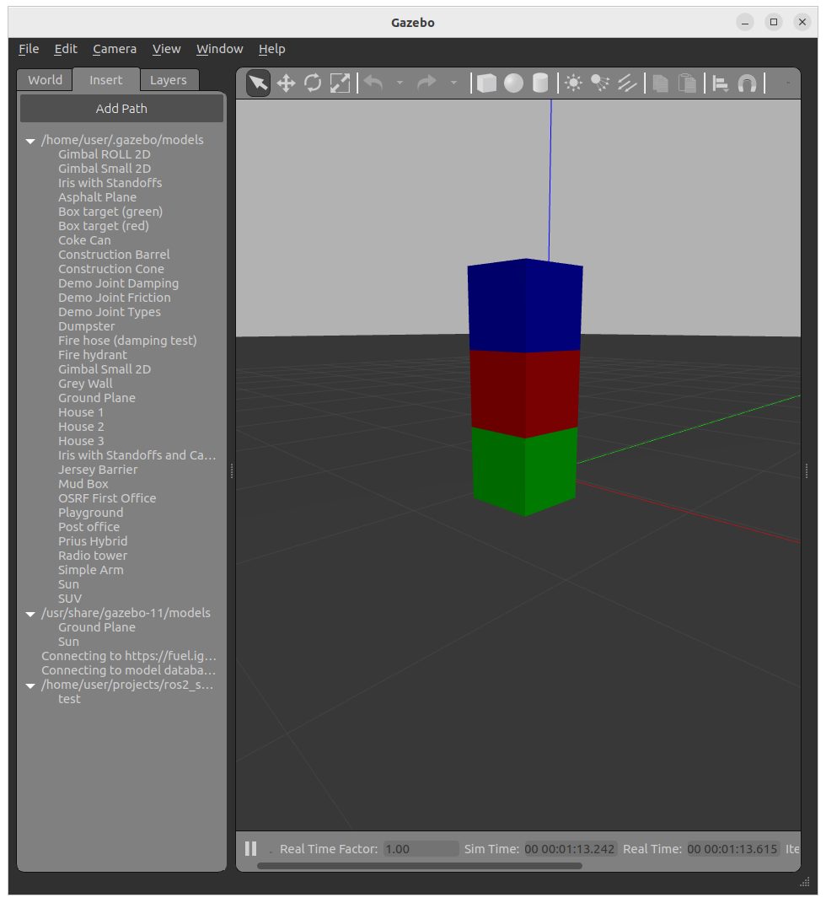
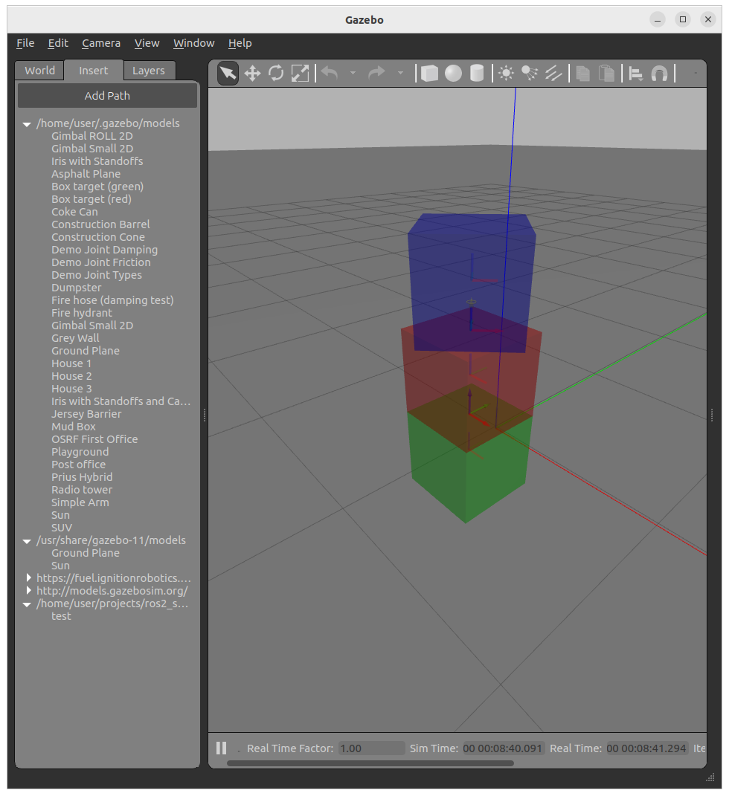

## LAB1
1. Build simple model with links and joints
     - three links same size 
     - one fixed joint
     - one revolute
     - control joints position and axes
2. Spawn model into gazebo
3. Add ros plugin for joint state and joint trajectory
4. Control joints from cli
5. Add launch file to spawn gazebo and model
6. Add simple node to set joint trajectory
7. Convert to xacro
   1. add macro to calc inertia
8. Check [Xacro can only take you so far](http://download.ros.org/downloads/roscon/2022/Xacro%20can%20only%20take%20you%20so%20far%20go%20further%20with%20EmPy%20and%20ERB!.pdf) from roscon
   1. Try convert the model to user EmPy
   2. Setup with VSCode

## reference
- [sdf specification](http://sdformat.org/spec)

## XXX



```bash
ros2 topic list
#
/clock
/joint_states
/parameter_events
/rosout
/set_joint_trajectory
```

```bash title="set_joint_trajectory"
ros2 topic pub -1 /set_joint_trajectory trajectory_msgs/msg/JointTrajectory '{header: {frame_id: world}, joint_names: [joint_child_fixed], points: [  {positions: {0.8}} ]}' 
```



!!! tip check gazebo view menu
    - show joints
    - show links frame
    - note joint axes rotation

!!! tip model develop
    Use gazebo **insert** TAB
     